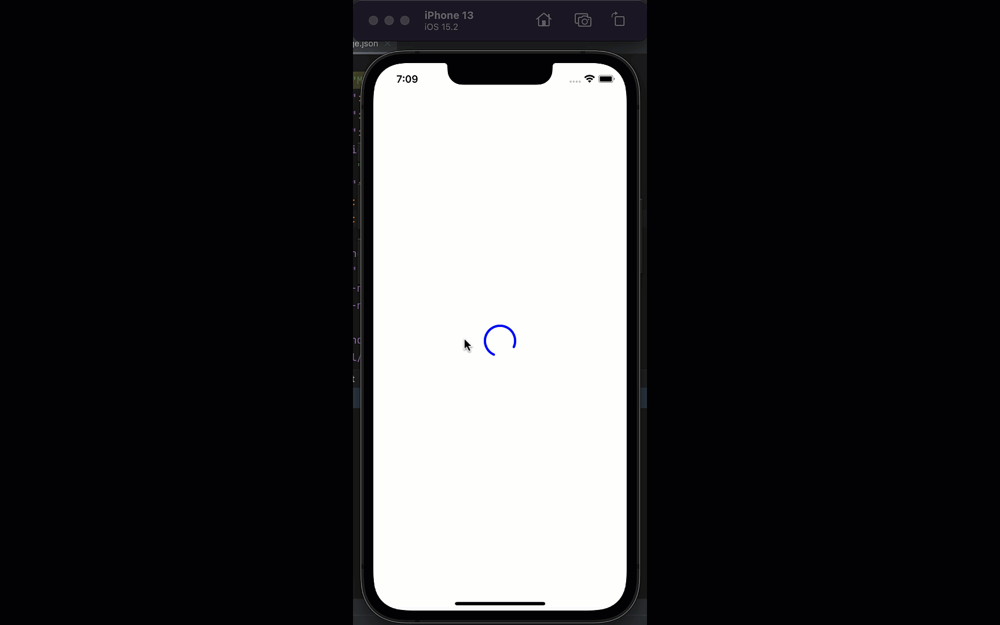

#react native spinner animation

this project an example of how to make a spinner using `react-native` without using any 3rd party library in the project.

##Live demo:



##Code:
```javascript

const App: () => Node = () => {
  const spinValue = new Animated.Value(0);

  const spin = () => {
    spinValue.setValue(0);
    Animated.timing(spinValue, {
      toValue: 1,
      duration: 1500,
      easing: Easing.linear,
      useNativeDriver: true,
    }).start(() => spin());
  };
  useEffect(() => {
    spin();
  }, []);

  const rotate = spinValue.interpolate({
    inputRange: [0, 1],
    outputRange: ['0deg', '360deg'],
  });
  return (
    <SafeAreaView>
      <View style={styles.container}>
        <Animated.View style={{transform: [{rotate}]}}>
          <AntDesign name={'loading1'} color={'blue'} size={50} />
        </Animated.View>
      </View>
    </SafeAreaView>
  );
};
```
Hope you like it.

